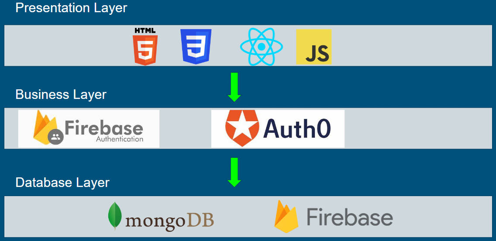
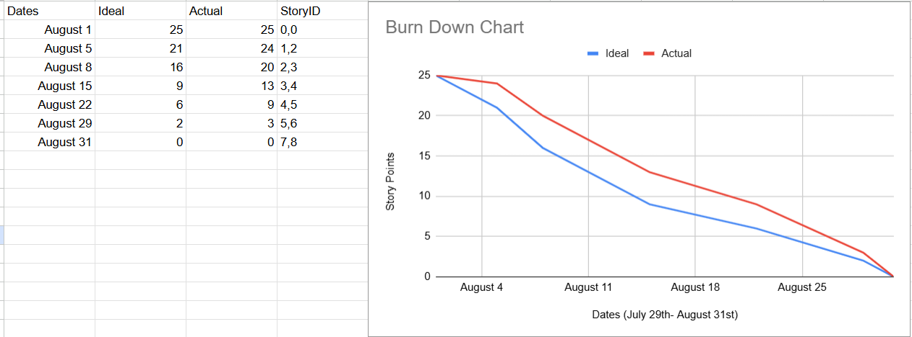

# Core Marker

## About: 
This is a Web app called “Core Marker” where people can write about their personal experiences within their local communities or around the world. A place for people to leave behind their memories that others can read across the Internet through their posts with/without photos to share. A place for people to reminisce or discover what communities or local public areas have occurred over time. A place where people can leave a historical record online that otherwise would have been dismissed in people’s history of daily life. 

*see final report and demo below 

## Team Authors: 
- Jimmy Delgado-Hernandez: https://github.com/Maker424
- Peter Lu: https://github.com/py1u
- Shiva Shashank Adlagatta: https://github.com/sala001
- Luke Nguyen: https://github.com/lukenguyen353

## Techniques Required: 
- Languages: HTML, CSS, Javascript
- Libraries: Chakra UI, ReactEmail, TailwindCSS
- APIs: Nodejs, Expressjs
- Frameworks: Vite
- Database: MongoDB

## Non-Functional Requirements: 
  Security: 
  - Include protections such as Login Verification and Input Sanitization to combat attacks

## Architecture: 
  Layered Architecture
  

- We will use HTML, CSS, and JavaScript to display our application, work on the UI, and structure of our applications.
- We will use Firebase or Auth0 to create a verification/business account option which could be used by our users.
- We will use Firebase or MongoDB well to create our database for our users.

## Build and Installation: 
  There are two sets of installations necessary, one set for the Frontend and another set for the Backend.
  Frontend installations:
  - npm install
  - npm install @emailjs/browser
  - npm install --save @chakra-ui/react
  - npm install jwt-decode

  Backend installations:

  - npm install
  - npm install cors
  - npm install express
  - npm install mongoose
  - npm install express-mongo-sanitize
  - npm install dotenv --save
  - npm install bcryptjs 
  - npm install jsonwebtoken
    
## Running the Program:
  1: Open a Backend Server terminal
  - cd into "core-marker-app"
  - cd into "Backend"
  - run "node mongodb.js"

  2: Open a Frontend Server terminal
  - cd into "core-marker-app"
  - run "npm run dev" 

  3: Open local host, create an account, and post away!
  
## Features: 
- As a new unregistered user I want to register an account so I can login in the future to use the App and all of its features. Story points 2, Priority 1
- As a registered user I want to login using my username and password so I can later log out of my account. Story points 2, Priority 2
- As an active user on my profile page I want to be able to customize and edit my profile information so I can display appropriate information for other users to view. Story points 5, Priority 3
- As an active user on the home page I want to be able to scroll on the home page so I can view other users posts and interact with them. Story points 7, Priority 4
- As an active user I want to search for posts and accounts so that I can find relevant content and find my friends. Story points 3, Priority 5
- As an active user I want to comment posts so I can interact with my friends and other users. Story points 3, Priority 6
- As an active user I want to access my settings so I can personalize and control my account information. Story points 1, Priority 7
- As an active user I want to contact the developers so I can give feedback or report problems about the App. Story points 2, Priority 8

## Burndown Chart:

## Final Report:
- see final_report_demo.pdf

## Final Demo:
https://drive.google.com/drive/folders/190LkZzle0qa2y-XioQ7WHoDqehelg93r?usp=sharing 
https://youtu.be/g6MSpo9LI20
